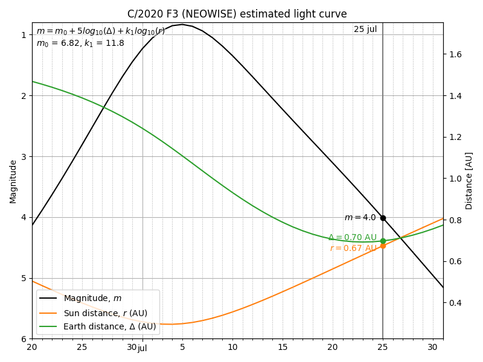

# C2020F3
Python utilities to compute observer ephemerides and light curve for comet C/2020 F3 (NEOWISE).

Requires the [PyEphem](https://pypi.org/project/ephem/) package and [matplotlib](https://matplotlib.org/) for plots.

---

#### light_curve.py

Predicted light curve of the comet using fits from observations. Using data from [JPL Horizons](https://ssd.jpl.nasa.gov/horizons.cgi) and fit from [Gideon van Buitenen](http://astro.vanbuitenen.nl/comet/2020F3).



---

#### compute_alts.py

Computes the comet's altitude over the horizon at sunrise and sunset for a given location.


---

#### compute_ephems.py

Computes a table of observer ephemerides (altitude-azimuth) of the comet for a given location and time span.

Example output:
```
Loaded elements from comets.txt

Ephemeris for C/2020 F3 (NEOWISE)
Location: Mexico City (19°16'47.6"N, 99°10'42.4"W)
Start: 2020-07-11 05:30:00 UTC-5
End: 2020-07-11 07:10:00 UTC-5

Local date/time       Comet Alt     Comet Az      Sun Alt       Sun Az       
2020-07-11 05:30:00   -2°24'49.8"   42°13'49.4"   -20°43'26.7"  56°09'56.5"  
2020-07-11 05:35:00   -1°50'38.7"   42°41'20.4"   -19°44'26.2"  56°49'08.0"  
2020-07-11 05:40:00   -1°17'37.8"   43°08'06.6"   -18°44'59.5"  57°27'19.8"  
2020-07-11 05:45:00   -0°42'17.9"   43°34'08.5"   -17°45'07.8"  58°04'34.1"  
2020-07-11 05:50:00   -0°03'44.9"   43°59'26.4"   -16°44'52.0"  58°40'52.7"  
2020-07-11 05:55:00   0°37'50.6"    44°24'00.6"   -15°44'13.1"  59°16'17.7"  
2020-07-11 06:00:00   1°21'53.7"    44°47'51.3"   -14°43'12.2"  59°50'50.7"  
2020-07-11 06:05:00   2°07'48.2"    45°10'58.9"   -13°41'50.0"  60°24'33.6"  
2020-07-11 06:10:00   2°55'05.7"    45°33'23.6"   -12°40'07.5"  60°57'27.9"  
2020-07-11 06:15:00   3°43'26.0"    45°55'05.6"   -11°38'05.5"  61°29'35.4"  
2020-07-11 06:20:00   4°32'35.2"    46°16'05.2"   -10°35'44.7"  62°00'57.5"  
2020-07-11 06:25:00   5°22'23.7"    46°36'22.5"   -9°33'06.0"   62°31'35.9"  
2020-07-11 06:30:00   6°12'44.9"    46°55'57.7"   -8°30'10.0"   63°01'31.8"  
2020-07-11 06:35:00   7°03'33.8"    47°14'50.8"   -7°25'17.8"   63°30'46.7"  
2020-07-11 06:40:00   7°54'47.1"    47°33'02.0"   -6°16'45.0"   63°59'21.9"  
2020-07-11 06:45:00   8°46'21.8"    47°50'31.3"   -4°56'20.4"   64°27'18.8"  
2020-07-11 06:50:00   9°38'15.9"    48°07'18.8"   -2°47'03.3"   64°54'38.4"  
2020-07-11 06:55:00   10°30'27.5"   48°23'24.4"   -1°56'08.4"   65°21'22.0"  
2020-07-11 07:00:00   11°22'55.3"   48°38'48.0"   -1°11'45.5"   65°47'30.8"  
2020-07-11 07:05:00   12°15'37.9"   48°53'29.6"   -0°23'20.1"   66°13'05.7"  
2020-07-11 07:10:00   13°08'34.2"   49°07'29.1"   0°30'19.1"    66°38'07.8" 
```
